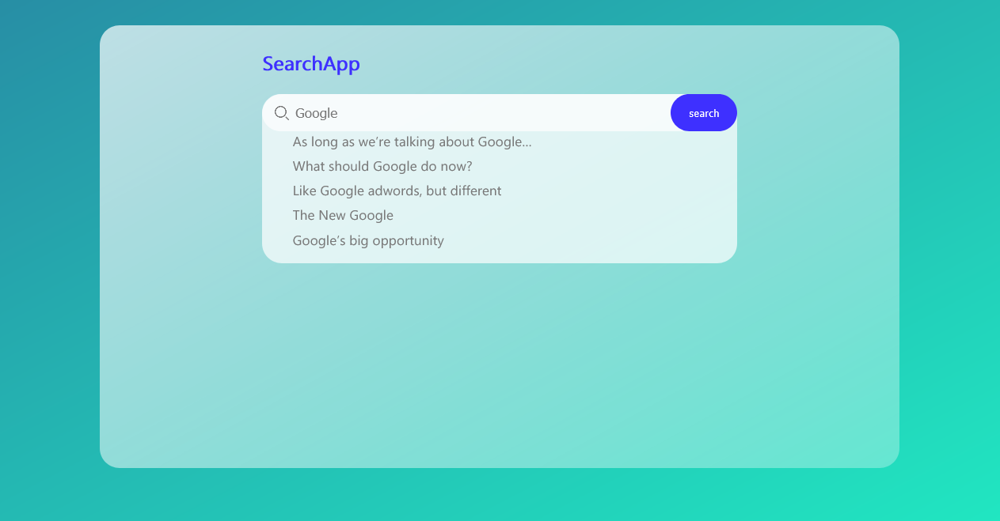
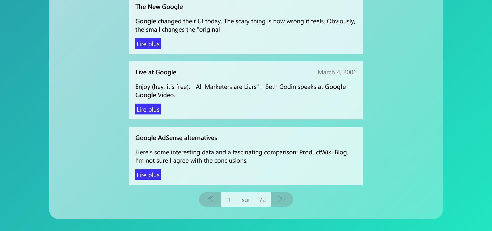

# Search-App
Ce projet/repo fait partie d'une série d'articles faisant une introduction sur elasticsearch. 

Ce projet illustre avec un exemple simple comment on peut exploiter la puissance d'elasticsearch pour facilement intégrer l'aspect de "recherche" sur une application.

## Demo
- Suggestion des termes de recherche

- Résultat de recherche 

- Pagination des résultats de recherhce


## Elasticsearch
Vous devez avoir elasticsearch installé sur votre système ou avec docker. Ce projet utilise <a href="https://github.com/IBJunior/elk-docker-compose"> ce repo</a> pour lancer elasticsearch et indexer les documents.
## Technologies à installer avant d'utiliser ce repo
- Vuejs version (^2.6.11) générer avec le CLI (@vue/cli 4.5.11)
- Nodejs (v14.15.2 ou plus)
- npm (6.14.9)
## Installer les dépendances  
```
cd back-end
npm install
```
```
cd front-end
npm install
```

### Lancer l'applciation sur un serveur
```
cd back-end
nodemon ./src/app.js
```

```
cd back-end
npm run serve
```
